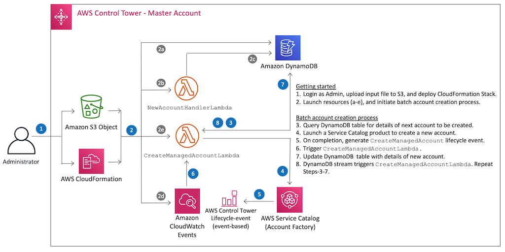

## AWS Control Tower Automate Account Creation 

AWS Control Tower is an AWS managed service that automates the creation of a well-architected multi-account AWS environment. This simplifies new account provisioning and centralized compliance for your AWS Organization. With AWS Control Tower, builders can provision new AWS accounts that conform to your company-wide policies in a few clicks. Creating accounts using AWS Control Tower’s Account Factory is a single-threaded process at this point, customers must allow for the current account creation process to complete before they can begin the next account creation process.
In this post, we demonstrate how you can automate the creation of multiple accounts in AWS Control Tower using a batch account creation process.  For example, you can use this solution to create a number of sandbox accounts for your application, or to create multiple accounts a new team. You can execute this batch process overnight or over a weekend, and when you return, your AWS Control Tower accounts are ready for use. The batch account creation process is also designed to handle some common mistakes that you may make when creating new accounts in AWS Control Tower.    

This solution uses the following AWS services:

* [AWS Control Tower](https://aws.amazon.com/controltower/)
* [AWS Service Catalog ](https://docs.aws.amazon.com/servicecatalog/latest/adminguide/introduction.html)
* [AWS CloudFormation](https://aws.amazon.com/cloudformation/)
* [Amazon CloudWatch](https://aws.amazon.com/cloudwatch/)
* [AWS Lambda](https://aws.amazon.com/lambda/)
* [Amazon DynamoDB](https://aws.amazon.com/dynamodb/)

## TLDR

1. Upload a CSV file with the exact same headers as sample.csv into an S3 bucket in the region you will deploy the solution.
2. Set the URL for the uploaded CSV file in the URLForInputCSVFile parameter in the BatchAccountCreation.yaml file.
3. Set your OU and AdminEmail parameters in the BatchAccountCreation.yaml file. (The OU parameter here is for the budget stack set ONLY.)
4. Deploy the BatchAccountCreation.yaml file in AWS CloudFormation.

## Prerequsites 

1. You have an AWS Control Tower landing zone deployed in your account.  You can refer to the AWS Control Tower User Guide on getting started.
2. To implement this solution, you must log in as the AWS Control Tower administrator into the organization master account in the AWS Region where you launched AWS Control Tower.

## Solution Overview

## Steps 

Steps 1–2 describe the initiation, while steps 3–8 describe the core of the batch account creation process.

**Step-1**:  Log in as the AWS Control Tower administrator, and deploy an AWS CloudFormation stack. You also upload provide an input file that contains the details of the accounts that you want to create in AWS Control Tower. These details are listed later in the blog.

**Step-2**:  When the stack is successfully deployed, it performs the following actions to set up the batch process.

**Step-2a**: It creates an Amazon DynamoDB table.  This table tracks the account creation status.

***Step-2b, 2c***: It creates an AWS Lambda function, NewAccountHandlerLambda.  This function validates the input file entries (see Step-1), and uploads the validated input file entries to the DynamoDB table.

***Step-2d***: It creates an Amazon CloudWatch Events rule that to detect the AWS Control Tower CreateManagedAccount lifecycle event.

***Step-2e***: It creates and triggers a Lambda function, CreateManagedAccountLambda.  This function initiates the batch account creation process.

**Step-3**: The CreateManagedAccountLambda queries the DynamoDB table to get the details of the next account to be created.  If there is another account to be created, then the batch account creation process moves on to Step-4, else it completes.

**Step-4**: The CreateManagedAccountLambda launches the AWS Control Tower Account factory product in AWS Service Catalog to create and provision a new account.

**Step-5**: After Account Factory has completed the account creation workflow, it generates the CreateManagedAccount lifecycle event, and the event log states if the workflow SUCCEEDED or FAILED.

**Step-6**: The CloudWatch Events rule detects the CreateManagedAccount lifecycle event, and triggers the CreateManagedAccountLambda function.

**Step-7**: The CreateManagedAccountLambda function updates the DynamoDB table with the results of the account creation workflow.  If the account was successfully created, it updates the input file entry in the DynamoDB table with the account ID, else it updates the entry in the table with the appropriate failure or error reason.

**Step-8**: When the DynamoDB table is updated, the DynamoDB stream triggers the CreateManagedAccountLambda function, and steps 3–7 are repeated.    

## Security

See [CONTRIBUTING](CONTRIBUTING.md#security-issue-notifications) for more information.

## License

This library is licensed under the MIT-0 License. See the LICENSE file.

